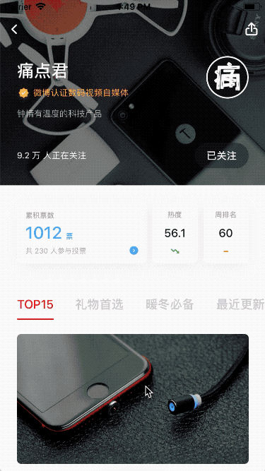

# Aquaman


[](https://www.apple.com/nl/ios/)
[](https://developer.apple.com/swift/)

类似于淘票票首页，抖音、简书个人主页的嵌套滚动库



## Requirements

- iOS 9.0+ 
- Swift 4.2+
- Xcode 10+


## Installation

#### [CocoaPods](http://cocoapods.org/)

```
use_frameworks!

pod 'Aquaman'
```

#### Swift Package Manager
Add the following dependency to your Package.swift manifest:

```
.package(url: "https://github.com/bawn/Aquaman.git", .branch("master")),
```

## Usage

[English documentation](https://github.com/bawn/Aquaman/blob/master/README-EN.md)

首先需要导入 Aquaman

```
import Aquaman
```


#### 创建 AquamanPageViewController 子类

```swift
import Aquaman

class PageViewController: AquamanPageViewController {
  // ...
}
```

#### 重写以下协议方法以提供 viewController 和相应的数量

```swift
override func numberOfViewControllers(in pageController: AquamanPageViewController) -> Int {
    return count
}
    
override func pageController(_ pageController: AquamanPageViewController, viewControllerAt index: Int) -> (UIViewController & AquamanChildViewController) {
    // ...
    return viewController
}
    
```

注意： 所提供的 viewController 必须都遵守 `AquamanChildViewController` 协议，并实现 `func aquamanChildScrollView() -> UIScrollView` 方法

```swift
import Aquaman
class ChildViewController: UIViewController, AquamanChildViewController {

    @IBOutlet weak var tableView: UITableView!
    func aquamanChildScrollView() -> UIScrollView {
        return tableView
    }
    // ...
}
```


#### 重写以下协议方法以提供 headerView 及其高度

```swift
override func headerViewFor(_ pageController: AquamanPageViewController) -> UIView {
    return HeaderView()
}

override func headerViewHeightFor(_ pageController: AquamanPageViewController) -> CGFloat {
    return headerViewHeight
}
```

#### 重写以下协议方法以提供 menuView 及其高度

```swift
override func menuViewFor(_ pageController: AquamanPageViewController) -> UIView {
    return menuView
}

override func menuViewHeightFor(_ pageController: AquamanPageViewController) -> CGFloat {
    return menuViewHeight
}
```

Aquaman 采用的是 menuView 和主体功能分离的设计，以满足 menuView 有时候需要深度定制的需求，所以 menuView 需要开发者自己实现，当然这里也提供了现成的 menuView 库：[Trident](https://github.com/bawn/Trident) 

#### 更新 menuView 的布局

```swift
override func pageController(_ pageController: AquamanPageViewController, contentScrollViewDidScroll scrollView: UIScrollView) {
    menuView.updateLayout(scrollView)
}

override func pageController(_ pageController: AquamanPageViewController, didDisplay viewController: (UIViewController & AquamanChildViewController), forItemAt index: Int) {
        menuView.checkState(animation: true)
}
```

由于 menuView 和 pageController 不存在强关联关系，所以在滚动的时候需要更新 menuView 布局，在显示相应的 viewController 的时候需要检查 menuView 的状态，具体参考 demo

## Examples

Follow these 4 steps to run Example project: 

1. Clone Aquaman repository
2. Run the `pod install` command 
3. Open Aquaman workspace 
4. Run the Aquaman-Demo project.

### License

Aquaman is released under the MIT license. See LICENSE for details.
